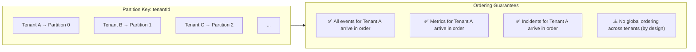
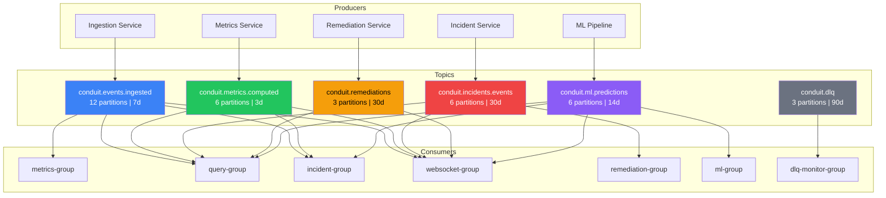

# Conduit Kafka Topic Design v3

## Topic Registry

| Topic | Partitions | Key | Retention | Compression | Cleanup Policy |
|---|:---:|---|---|---|---|
| `conduit.events.ingested` | **12** | `tenantId` | 7 days | Snappy | delete |
| `conduit.metrics.computed` | **6** | `tenantId` | 3 days | Snappy | compact+delete |
| `conduit.incidents.events` | **6** | `tenantId` | 30 days | Snappy | delete |
| `conduit.ml.predictions` | **6** | `tenantId` | 14 days | Snappy | delete |
| `conduit.remediations` | **3** | `tenantId` | 30 days | Snappy | delete |
| `conduit.dlq` | **3** | `originalTopic` | 90 days | GZIP | delete |

---

## Partition Strategy



**Rationale for partition counts:**

| Topic | Count | Reasoning |
|---|:---:|---|
| `events.ingested` | 12 | Highest volume (1000+ msg/sec). 12 allows 12 parallel consumers per group for scale-out. |
| `metrics.computed` | 6 | Aggregated snapshots, lower volume (~10x fewer than raw events). |
| `incidents.events` | 6 | Low volume but critical. 6 allows future multi-AZ consumer parallelism. |
| `ml.predictions` | 6 | Moderate volume, aligned with metrics for balanced consumer assignment. |
| `remediations` | 3 | Lowest volume (only triggered incidents produce actions). |
| `dlq` | 3 | Minimal expected volume. Keyed by `originalTopic` for routing. |

---

## Retention Strategy

```
                    Hot Path                            Cold Path
              ┌─────────────────┐               ┌──────────────────┐
  events      │     7 days      │   incidents    │     30 days      │
  metrics     │     3 days      │   remediations │     30 days      │
              └─────────────────┘   ml.predict.  │     14 days      │
                                    dlq          │     90 days      │
                                                 └──────────────────┘
```

| Topic | Retention | Why |
|---|---|---|
| `events.ingested` | **7d** | High volume, consumed within seconds. 7d covers replay after extended outages. |
| `metrics.computed` | **3d** | Compact+delete: latest per-key is always available; older snapshots auto-purge. |
| `incidents.events` | **30d** | Compliance: incident audit trail must survive monthly review cycles. |
| `ml.predictions` | **14d** | Model retraining windows typically span 7–14 days of historical predictions. |
| `remediations` | **30d** | Audit: automated actions must be traceable for 30 days post-incident. |
| `dlq` | **90d** | Ops investigation: failed messages may not be reviewed immediately. |

---

## Consumer Groups

| Group ID | Service | Subscribed Topics |
|---|---|---|
| `conduit-metrics-group` | Metrics Service | `events.ingested` |
| `conduit-query-group` | Query Service | `events.ingested`, `metrics.computed`, `incidents.events`, `ml.predictions` |
| `conduit-incident-group` | Incident Service | `events.ingested`, `metrics.computed`, `ml.predictions` |
| `conduit-websocket-group` | WebSocket Service | `events.ingested`, `metrics.computed`, `incidents.events`, `remediations`, `ml.predictions` |
| `conduit-remediation-group` | Remediation Service | `incidents.events` |
| `conduit-ml-group` | ML Pipeline | `ml.predictions` (self-monitoring) |
| `conduit-dlq-monitor-group` | Ops Tooling | `dlq` |

---

## Fan-Out Topology



---

## WebSocket Channel Mapping

| Kafka Topic | WebSocket Channel | Client Subscription |
|---|---|---|
| `conduit.events.ingested` | `events:live` | Real-time event feed |
| `conduit.metrics.computed` | `metrics:dashboard` | Dashboard metric updates |
| `conduit.incidents.events` | `incidents:alerts` | Incident alert notifications |
| `conduit.remediations` | `remediations:actions` | Autonomous action feed |
| `conduit.ml.predictions` | `ml:predictions` | ML anomaly score updates |

---

## Files Modified

| File | Change |
|---|---|
| [topics.js](file:///d:/congnigant/backend-v1/packages/shared/src/kafka/topics.js) | Added `ML_PREDICTIONS`, `CONSUMER_GROUPS`, `SUBSCRIPTIONS`. Renamed `conduit.incidents` → `conduit.incidents.events` |
| [topics.sh](file:///d:/congnigant/backend-v1/infra/kafka/topics.sh) | Complete rewrite with differentiated retention, compression, segment policies |
| [index.js](file:///d:/congnigant/backend-v1/packages/shared/src/index.js) | Barrel now exports `CONSUMER_GROUPS` and `SUBSCRIPTIONS` |
| [kafkaBridge.js](file:///d:/congnigant/backend-v1/services/websocket-service/src/bridge/kafkaBridge.js) | Added `ML_PREDICTIONS` to subscription |
| [subscriptionEngine.js](file:///d:/congnigant/backend-v1/services/websocket-service/src/subscriptions/subscriptionEngine.js) | Added `ml:predictions` channel |
| [connectionManager.js](file:///d:/congnigant/backend-v1/services/websocket-service/src/connections/connectionManager.js) | Added `ml:predictions` to whitelist |
| [detectionConsumer.js](file:///d:/congnigant/backend-v1/services/incident-service/src/consumers/detectionConsumer.js) | Now consumes `ML_PREDICTIONS` for ML-driven detection |
| [materializer.js](file:///d:/congnigant/backend-v1/services/query-service/src/consumers/materializer.js) | Materializes incidents + ML predictions |
| [.env.example](file:///d:/congnigant/backend-v1/.env.example) | Added `KAFKA_GROUP_ID_ML`, `KAFKA_GROUP_ID_DLQ` |
