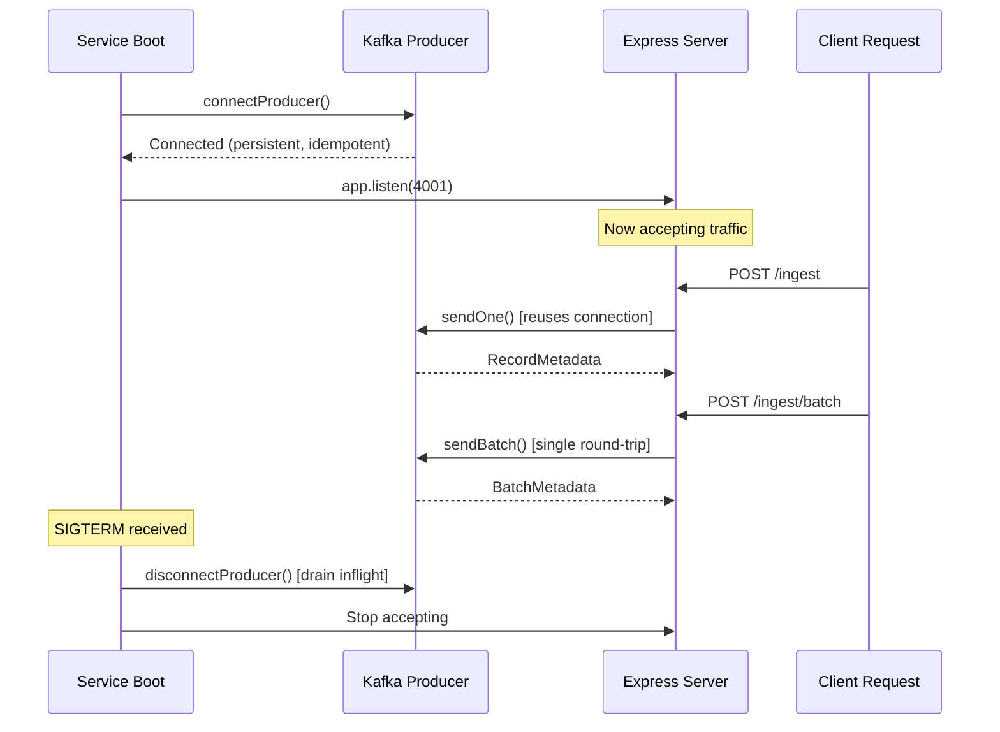
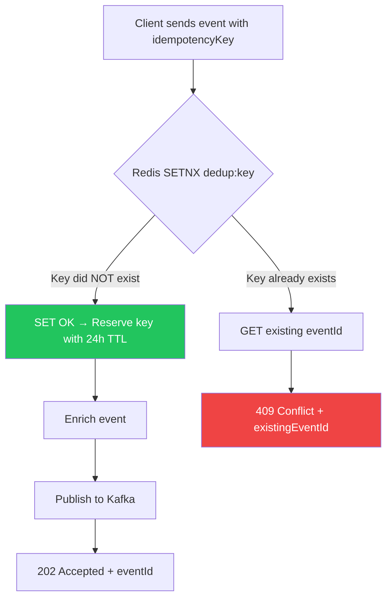

# Ingestion Service v2 — Production Architecture

## What Changed (Before → After)

| Aspect | v1 (Before) | v2 (After) |
|---|---|---|
| **Kafka Producer** | Lazy singleton via shared — connects on first request | Persistent, pre-connected at boot. Zero cold-start latency. |
| **Idempotency** | `new Set()` — in-memory, leaks forever, lost on restart | Redis `SETNX` with 24h TTL — survives restarts, works across instances |
| **Batch Support** | None — 1 event per HTTP call | `POST /ingest/batch` — up to 500 events in one request + one Kafka round-trip |
| **Health Probes** | Basic `/health` | `/health` (with dependency status) + `/ready` (K8s readiness gate) |
| **Boot Order** | Undefined — Express starts before Kafka connects | Deterministic: Redis → Kafka → HTTP (traffic only after both ready) |
| **Shutdown** | None | Graceful: drain Kafka inflight → close Redis → exit |
| **Kafka Metadata** | Hardcoded `{ partition: 0 }` | Real broker metadata: partition, offset, timestamp |
| **Compression** | None | Snappy (optimized for throughput) |

---

## Code Structure

```
ingestion-service/
├── package.json
└── src/
    ├── index.js                    # Boot lifecycle: Redis → Kafka → HTTP
    ├── infra/
    │   ├── redis.js                # Managed Redis client with ready-state
    │   └── producerPool.js         # Persistent Kafka producer (connect-once)
    ├── dedup/
    │   └── idempotencyGuard.js     # Redis SETNX dedup (single + batch)
    ├── validators/
    │   └── eventValidator.js       # Ajv strict mode (compiled once)
    ├── enrichers/
    │   └── timestampEnricher.js    # UTC normalization
    ├── publishers/
    │   └── kafkaPublisher.js       # sendOne + sendBatch wrappers
    └── routes/
        └── ingest.js               # POST / (single) + POST /batch
```

---

## Kafka Producer Lifecycle



> [!IMPORTANT]
> The producer connects **once** at boot and is reused for the entire process lifetime. There is zero TCP/TLS handshake overhead per request — critical for sustaining 1000+ req/sec.

---

## Idempotency Flow



**Key design decisions:**
- **`SETNX` + `EX` in one command** — atomic check-and-set with TTL, single Redis round-trip
- **Fail-closed** — if Redis is down, requests are rejected (not silently duplicated)
- **24h TTL** — keys auto-expire, no manual cleanup needed
- **Batch pipeline** — bulk dedup uses Redis pipeline for minimal round-trips

---

## Optimized Ingestion Flow

### Single Event: `POST /ingest`

```
Client → Gateway → Ingestion
                      │
                      ├─ 1. Ajv validate (compiled schema, ~0.1ms)
                      ├─ 2. UUID assign
                      ├─ 3. Redis SETNX check (~0.3ms)
                      ├─ 4. Enrich (timestamps, tenant, correlation)
                      ├─ 5. Kafka sendOne (persistent conn, Snappy, ~2ms)
                      └─ 6. 202 { eventId, partition, offset }
```

### Batch: `POST /ingest/batch` (up to 500 events)

```
Client → Gateway → Ingestion
                      │
                      ├─ 1. Validate all events (Ajv loop)
                      ├─ 2. Assign UUIDs
                      ├─ 3. Redis pipeline SETNX (1 round-trip for 500 keys)
                      ├─ 4. Separate: new events vs duplicates
                      ├─ 5. Kafka sendBatch (1 round-trip for all new events)
                      └─ 6. 202 { accepted: N, duplicates: M, results: [...] }
```

---

## Throughput Design

| Technique | Impact |
|---|---|
| **Persistent producer** | Eliminates ~50ms TCP/TLS handshake per request |
| **Snappy compression** | ~60% payload reduction with minimal CPU |
| **`acks: -1`** (all ISRs) | Durability guarantee without sacrificing throughput |
| **`maxInFlightRequests: 5`** | 5 concurrent batches in-flight (idempotent-safe) |
| **Batch endpoint** | Amortizes HTTP + Kafka overhead across 500 events |
| **Redis pipeline** | Bulk dedup in 1 round-trip instead of 500 |
| **Compiled Ajv** | Schema compiled once at module load, validated in ~0.1ms |

---

## API Reference

### `POST /ingest` — Single Event

```json
// Request
{
  "eventType": "transaction.created",
  "source": "payment-gateway",
  "timestamp": "2026-05-03T00:00:00Z",
  "payload": { "amount": 99.99, "currency": "USD" },
  "idempotencyKey": "550e8400-e29b-41d4-a716-446655440000"
}

// Response (202)
{
  "eventId": "a1b2c3d4-...",
  "status": "accepted",
  "partition": 2,
  "offset": "1847"
}

// Response (409 — duplicate)
{
  "error": "DUPLICATE_EVENT",
  "existingEventId": "original-uuid",
  "idempotencyKey": "550e8400-..."
}
```

### `POST /ingest/batch` — Batch Ingestion

```json
// Request
{
  "events": [
    { "eventType": "transaction.created", "source": "...", "timestamp": "...", "payload": {}, "idempotencyKey": "..." },
    { "eventType": "transaction.completed", "source": "...", "timestamp": "...", "payload": {}, "idempotencyKey": "..." }
  ]
}

// Response (202)
{
  "status": "accepted",
  "total": 2,
  "accepted": 1,
  "duplicates": 1,
  "results": {
    "accepted": [{ "eventId": "..." }],
    "duplicates": [{ "index": 1, "idempotencyKey": "...", "existingEventId": "..." }]
  }
}
```
