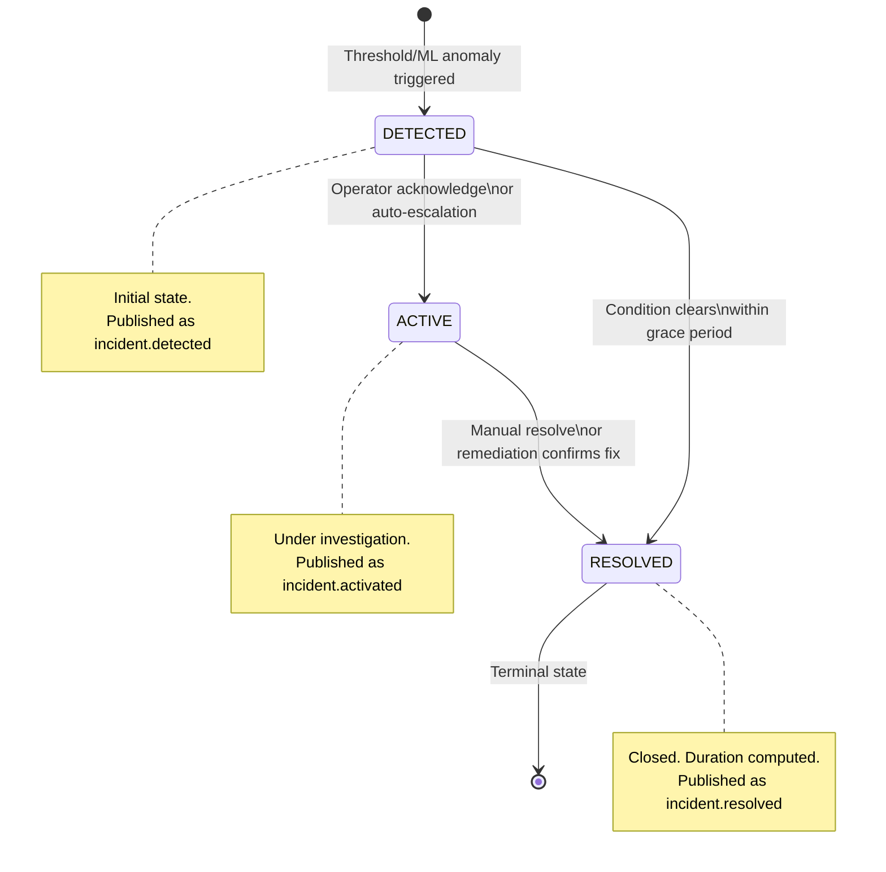
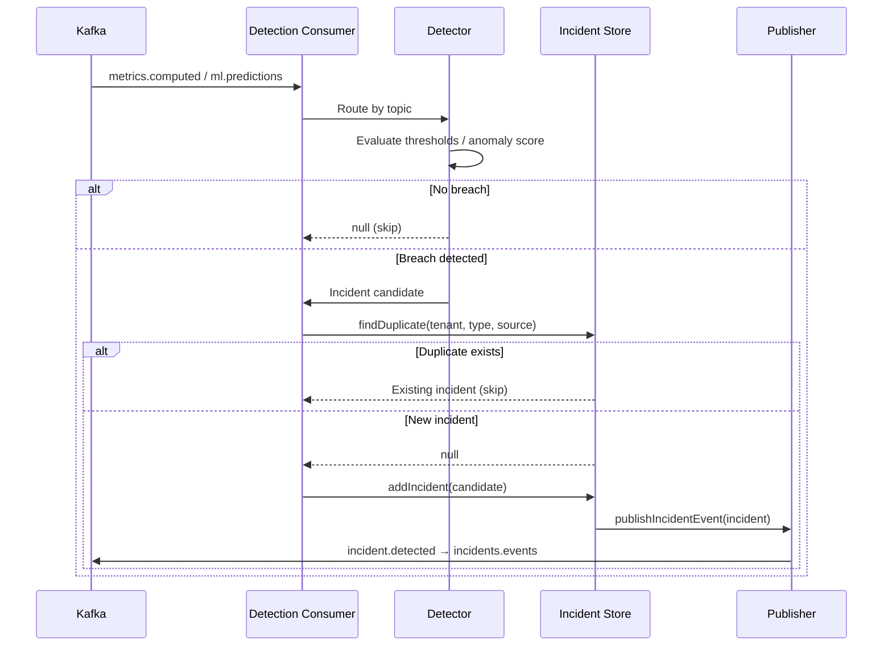

# Incident Service v2 — Detection + State Machine

## What Changed (Before → After)

| Aspect | v1 (Before) | v2 (After) |
|---|---|---|
| **Inputs** | `events.ingested` + `metrics.computed` + `ml.predictions` | **Only** `metrics.computed` + `ml.predictions` (strict separation) |
| **State Machine** | Ad-hoc status field, 6 states, no enforcement | Formal `DETECTED → ACTIVE → RESOLVED` with immutable transitions |
| **ML Detection** | Ignored `ml_prediction` sourceType | Dedicated `mlDetector.js` with anomaly score + label classification |
| **Deduplication** | None — duplicate incidents per threshold breach | 5-minute dedup window per `tenant:type:source` key |
| **Event Publishing** | Only published on detection | Publishes on every lifecycle transition (`detected`, `activated`, `resolved`) |
| **Severity** | Simple comparison against single threshold | Multi-tier severity classification with configurable thresholds |
| **Duration Tracking** | None | Auto-computed `duration` (ms) on resolution |

---

## State Machine



### Valid Transitions

| From | Allowed Targets | Kafka Event |
|---|---|---|
| `detected` | `active`, `resolved` | `incident.activated` or `incident.resolved` |
| `active` | `resolved` | `incident.resolved` |
| `resolved` | *(terminal — no transitions)* | — |

---

## Architecture

```mermaid
flowchart TD
    subgraph KafkaIn["Kafka Inputs"]
        MC["conduit.metrics.computed"]
        ML["conduit.ml.predictions"]
    end

    subgraph IncidentService["Incident Service"]
        CON["Detection Consumer"]
        
        subgraph Detectors["Detectors"]
            TD["Threshold Detector\n(error rate, p95, success rate)"]
            MLD["ML Anomaly Detector\n(anomaly score, labels)"]
        end

        subgraph StateLayer["State Management"]
            SM["State Machine\n(DETECTED → ACTIVE → RESOLVED)"]
            ST["Incident Store\n(dedup + CRUD)"]
        end

        PUB["Incident Publisher"]
        REST["REST API\n/incidents/*"]
    end

    subgraph KafkaOut["Kafka Output"]
        IE["conduit.incidents.events"]
    end

    MC --> CON
    ML --> CON
    CON --> TD
    CON --> MLD
    TD --> ST
    MLD --> ST
    ST --> SM
    SM --> PUB
    PUB --> IE

    REST --> SM
    SM --> PUB

    style Detectors fill:#ef4444,color:#fff
    style StateLayer fill:#3b82f6,color:#fff
    style KafkaOut fill:#22c55e,color:#fff
```



---

## Detection Pipeline



---

## Code Structure

```
incident-service/
├── package.json
└── src/
    ├── index.js                           # Boot lifecycle + health + readiness
    ├── consumers/
    │   └── detectionConsumer.js            # Kafka consumer (metrics + ML only)
    ├── detectors/
    │   ├── thresholdDetector.js            # Error rate, p95 latency, success rate
    │   └── mlDetector.js                   # Anomaly score + label classification
    ├── state/
    │   ├── incidentStateMachine.js         # DETECTED → ACTIVE → RESOLVED
    │   └── incidentStore.js               # In-memory store with dedup
    ├── publishers/
    │   └── incidentPublisher.js            # Lifecycle event publisher
    └── routes/
        └── incidents.js                   # REST API with enforced transitions
```

---

## Detectors

### Threshold Detector (metrics.computed)

| Metric | Default Threshold | Severity Tiers |
|---|---|---|
| Error Rate | `> 5%` | ≥20% critical, ≥10% high, ≥5% medium, ≥3% low |
| P95 Latency | `> 3000ms` | ≥10s critical, ≥5s high, ≥3s medium, ≥2s low |
| Success Rate | `< 95%` | ≤80% critical, ≤90% high, ≤95% medium, ≤98% low |

### ML Anomaly Detector (ml.predictions)

| Field | Usage |
|---|---|
| `anomalyScore` | Primary trigger — must exceed `ML_ANOMALY_THRESHOLD` (default: 0.75) |
| `label` | Overrides score-based severity if label matches known pattern |
| `modelId` | Tracked in incident for audit trail |
| `confidence` | Stored in trigger data for investigation |

**Label → Severity Map:**

| Label | Severity |
|---|---|
| `system_failure`, `cascading_failure` | critical |
| `performance_degradation`, `traffic_spike` | high |
| `latency_drift`, `metric_anomaly` | medium |

---

## REST API

| Method | Path | Description |
|---|---|---|
| `GET` | `/incidents` | List with filters (`?status=active&severity=high&tenantId=...`) |
| `GET` | `/incidents/counts` | Dashboard: `{ detected: 3, active: 1, resolved: 12 }` |
| `GET` | `/incidents/:id` | Single incident detail |
| `PATCH` | `/incidents/:id/transition` | State transition: `{ "status": "active" }` |

Every `PATCH /transition` publishes a lifecycle event to `conduit.incidents.events`.

---

## Deduplication

```
Dedup Key: ${tenantId}:${type}:${source}
Window:    5 minutes (INCIDENT_DEDUP_WINDOW_MS)

Example:   acme-corp:error_rate_breach:payment-api

Behavior:
  - If an active incident exists for this key → skip (no duplicate)
  - If the window expired → create new incident
  - On resolve → remove from dedup index
```

---

## Tuning Knobs

| Env Variable | Default | Description |
|---|---|---|
| `INCIDENT_DEDUP_WINDOW_MS` | `300000` | Dedup window (5 min) |
| `THRESHOLD_ERROR_RATE` | `0.05` | Error rate trigger |
| `THRESHOLD_P95_LATENCY_MS` | `3000` | P95 latency trigger |
| `THRESHOLD_SUCCESS_RATE` | `0.95` | Success rate floor |
| `ML_ANOMALY_THRESHOLD` | `0.75` | ML anomaly score trigger |

---

## Files Modified

| File | Change |
|---|---|
| [incidentStateMachine.js](file:///d:/congnigant/backend-v1/services/incident-service/src/state/incidentStateMachine.js) | **NEW** — Formal state machine with DETECTED → ACTIVE → RESOLVED |
| [incidentStore.js](file:///d:/congnigant/backend-v1/services/incident-service/src/state/incidentStore.js) | **NEW** — In-memory store with 5-min dedup window |
| [thresholdDetector.js](file:///d:/congnigant/backend-v1/services/incident-service/src/detectors/thresholdDetector.js) | **REBUILT** — Now evaluates p95 latency + success rate, multi-tier severity |
| [mlDetector.js](file:///d:/congnigant/backend-v1/services/incident-service/src/detectors/mlDetector.js) | **NEW** — ML anomaly detection with score + label classification |
| [detectionConsumer.js](file:///d:/congnigant/backend-v1/services/incident-service/src/consumers/detectionConsumer.js) | **REBUILT** — Scoped to metrics.computed + ml.predictions only |
| [incidentPublisher.js](file:///d:/congnigant/backend-v1/services/incident-service/src/publishers/incidentPublisher.js) | **REBUILT** — Typed lifecycle events with full context |
| [incidents.js](file:///d:/congnigant/backend-v1/services/incident-service/src/routes/incidents.js) | **REBUILT** — State-machine-enforced transitions, counts endpoint |
| [index.js](file:///d:/congnigant/backend-v1/services/incident-service/src/index.js) | **REBUILT** — Deterministic boot, readiness probe |
| [.env.example](file:///d:/congnigant/backend-v1/.env.example) | **UPDATED** — Added threshold + dedup + ML config |
