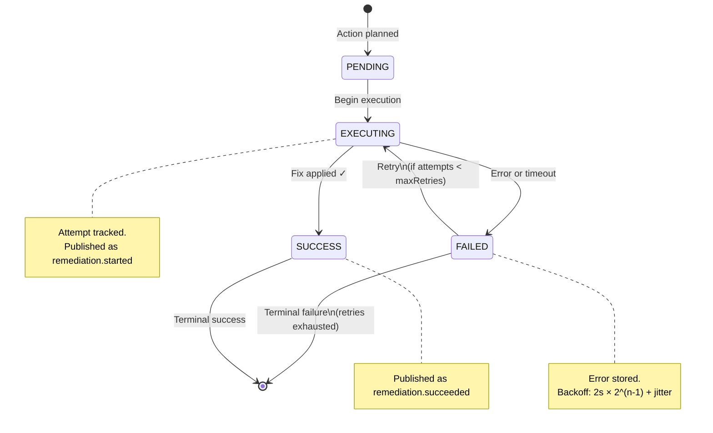
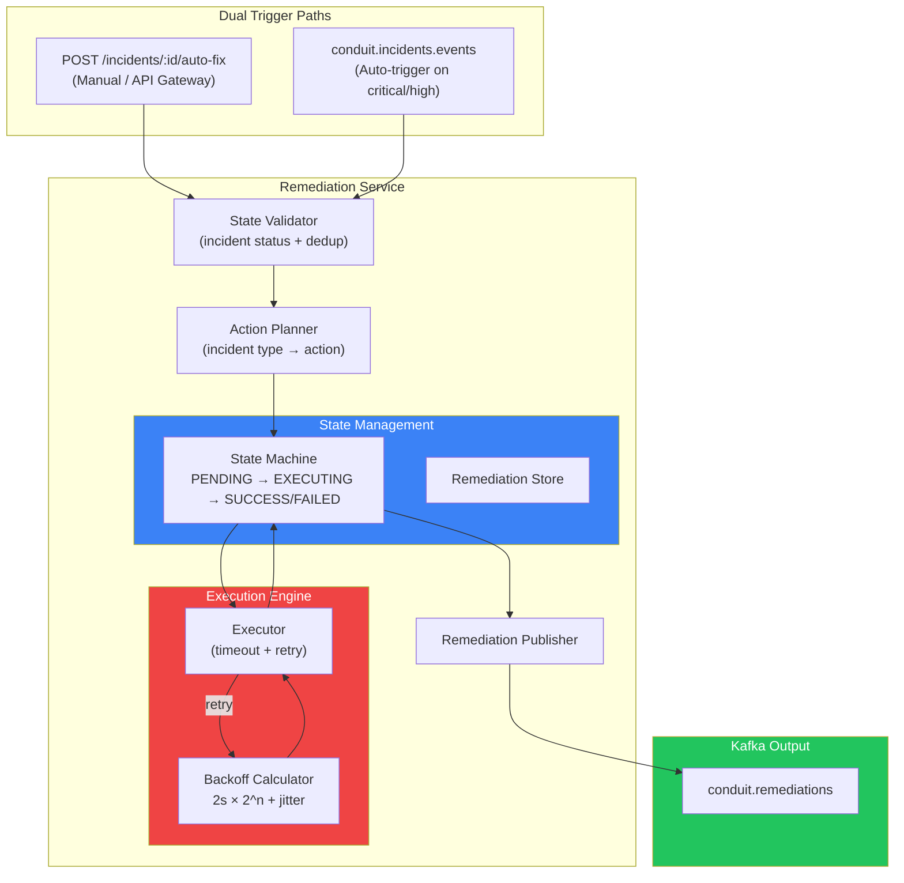
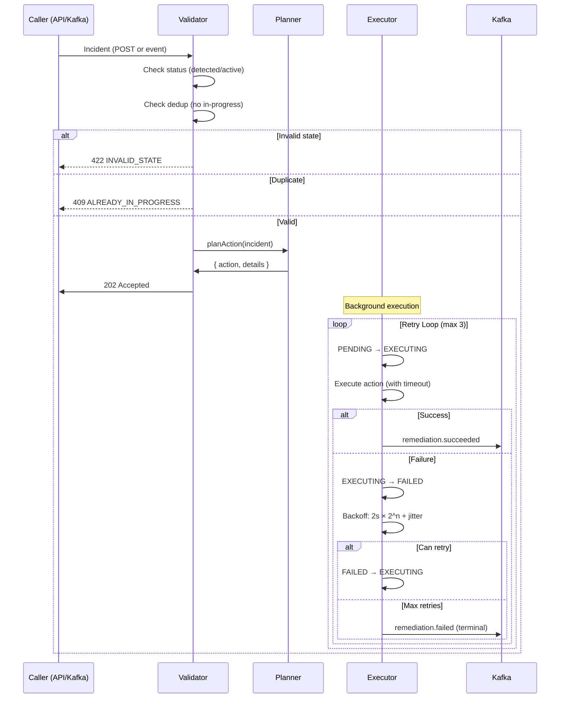

# Remediation Service v2 — Auto-Fix + Retry Engine

## What Changed (Before → After)

| Aspect | v1 (Before) | v2 (After) |
|---|---|---|
| **Trigger** | Kafka-only (no REST) | **Dual**: `POST /incidents/:id/auto-fix` + Kafka auto-trigger |
| **State Machine** | None — jumped straight to `executed` | `PENDING → EXECUTING → SUCCESS \| FAILED` with retry loop |
| **Retry Logic** | None — single attempt | Exponential backoff with jitter, capped at 30s, max 3 retries |
| **Failure Handling** | Silent — lost on error | Full lifecycle events, terminal failure tracking |
| **Action Registry** | 3 hardcoded actions | 5 actions including ML anomaly support, severity gating |
| **Deduplication** | None | Prevents duplicate in-progress remediations per incident |
| **Kafka Events** | Single `executed` event | Typed: `started`, `succeeded`, `failed` |

---

## State Machine



---

## Architecture



---

## Execution Flow



---

## Retry Strategy

```
Attempt 1: immediate
Attempt 2: 2000ms + jitter(0-500ms) = ~2.0-2.5s
Attempt 3: 4000ms + jitter(0-500ms) = ~4.0-4.5s

Max delay cap: 30,000ms
Action timeout: 30,000ms per attempt
```

---

## Action Registry

| Incident Type | Action | Auto-Trigger | Est. Duration |
|---|---|---|---|
| `error_rate_breach` | `auto_rollback` | ✅ critical/high | 15s |
| `latency_breach` | `scale_out` | ✅ critical/high | 30s |
| `success_rate_drop` | `health_check_sweep` | ✅ critical/high | 10s |
| `ml_anomaly` | `adaptive_throttle` | ✅ critical/high | 5s |
| *(unknown)* | `notify_on_call` | ❌ | 0s |

---

## REST API

| Method | Path | Description | Response |
|---|---|---|---|
| `POST` | `/incidents/:id/auto-fix` | Trigger remediation | `202 Accepted` |
| `GET` | `/remediations` | List with filters | `200 OK` |
| `GET` | `/remediations/counts` | Dashboard: `{ pending, executing, success, failed }` | `200 OK` |
| `GET` | `/remediations/:id` | Single remediation detail | `200 OK` |
| `GET` | `/remediations/by-incident/:id` | Latest remediation for incident | `200 OK` |

### POST /incidents/:id/auto-fix — Request

```json
{
  "incidentId": "abc-123",
  "tenantId": "acme-corp",
  "severity": "critical",
  "type": "error_rate_breach",
  "status": "detected",
  "source": "payment-api"
}
```

### POST /incidents/:id/auto-fix — Response (202)

```json
{
  "message": "Remediation initiated",
  "remediationId": "rem-456",
  "action": "auto_rollback",
  "details": "Triggering canary rollback to previous stable version (source: payment-api)",
  "maxRetries": 3
}
```

---

## Code Structure

```
remediation-service/
├── package.json
└── src/
    ├── index.js                             # Boot lifecycle + health + readiness
    ├── consumers/
    │   └── incidentConsumer.js               # Kafka auto-trigger (critical/high)
    ├── engine/
    │   ├── actionPlanner.js                  # Incident type → action mapping
    │   └── remediationEngine.js              # Executor with retry + backoff + timeout
    ├── publishers/
    │   └── remediationPublisher.js           # Lifecycle events to Kafka
    ├── routes/
    │   └── remediations.js                   # REST API + POST /incidents/:id/auto-fix
    └── state/
        ├── remediationStateMachine.js        # PENDING → EXECUTING → SUCCESS/FAILED
        └── remediationStore.js               # In-memory store with incident index
```

---

## Tuning Knobs

| Env Variable | Default | Description |
|---|---|---|
| `REMEDIATION_PORT` | `4007` | HTTP server port |
| `REMEDIATION_MAX_RETRIES` | `3` | Max retry attempts per action |
| `REMEDIATION_RETRY_DELAY_MS` | `2000` | Base delay for exponential backoff |
| `REMEDIATION_TIMEOUT_MS` | `30000` | Per-attempt action timeout |

---

## Files Modified

| File | Change |
|---|---|
| [remediationStateMachine.js](file:///d:/congnigant/backend-v1/services/remediation-service/src/state/remediationStateMachine.js) | **NEW** — PENDING → EXECUTING → SUCCESS/FAILED with retry |
| [remediationStore.js](file:///d:/congnigant/backend-v1/services/remediation-service/src/state/remediationStore.js) | **NEW** — In-memory store with incident index |
| [actionPlanner.js](file:///d:/congnigant/backend-v1/services/remediation-service/src/engine/actionPlanner.js) | **NEW** — Action registry with 5 action types |
| [remediationEngine.js](file:///d:/congnigant/backend-v1/services/remediation-service/src/engine/remediationEngine.js) | **REBUILT** — Full retry engine with timeout + backoff |
| [remediationPublisher.js](file:///d:/congnigant/backend-v1/services/remediation-service/src/publishers/remediationPublisher.js) | **NEW** — Typed lifecycle events |
| [remediations.js](file:///d:/congnigant/backend-v1/services/remediation-service/src/routes/remediations.js) | **NEW** — REST API with POST /incidents/:id/auto-fix |
| [incidentConsumer.js](file:///d:/congnigant/backend-v1/services/remediation-service/src/consumers/incidentConsumer.js) | **REBUILT** — Auto-trigger with severity gating + dedup |
| [index.js](file:///d:/congnigant/backend-v1/services/remediation-service/src/index.js) | **REBUILT** — Deterministic boot + health |
| [.env.example](file:///d:/congnigant/backend-v1/.env.example) | **UPDATED** — Added retry/timeout/delay config |
