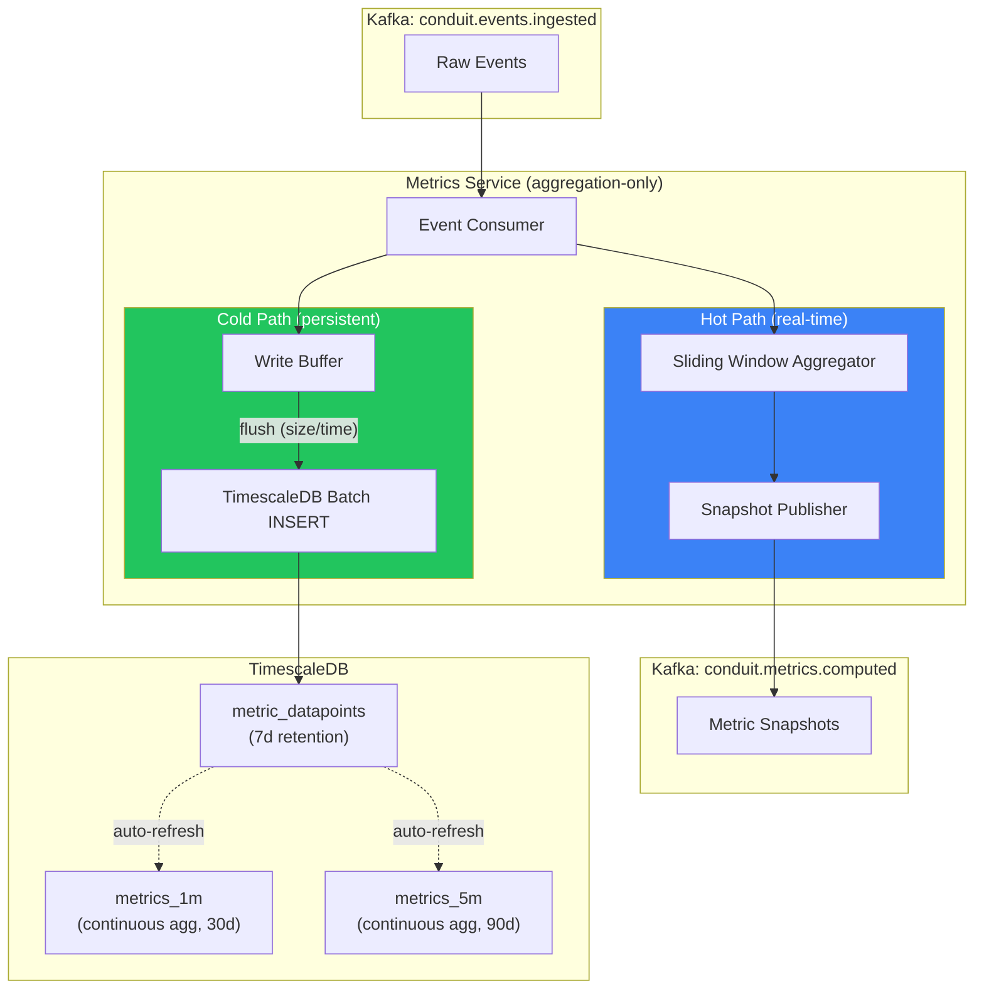
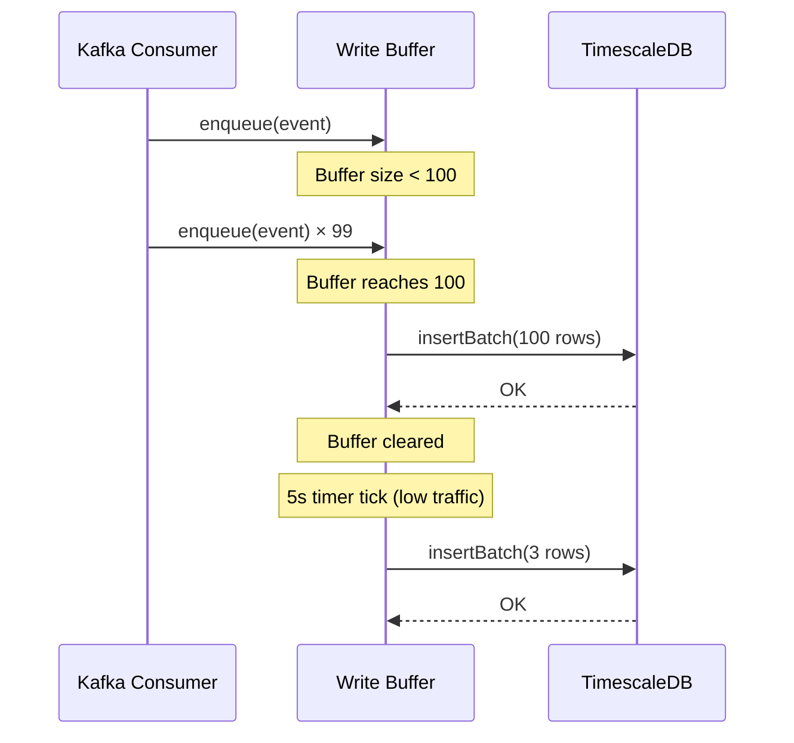

# Metrics Service v2 — Production Aggregation Pipeline

## What Changed (Before → After)

| Aspect | v1 (Before) | v2 (After) |
|---|---|---|
| **Aggregator** | In-memory only, no window expiry, unbounded growth | Time-based sliding window with automatic eviction |
| **Percentiles** | None — only avg latency | p50, p95, p99 via linear interpolation (matches PostgreSQL `PERCENTILE_CONT`) |
| **Success Rate** | Not computed | Explicit `successRate` + `successCount` in every snapshot |
| **Persistence** | None — data lost on restart | TimescaleDB hypertable with buffered batch writes |
| **Continuous Aggregates** | None | 1-minute and 5-minute materialized views with auto-refresh |
| **Retention** | None (unbounded in-memory) | Tiered: 7d raw → 30d 1m → 90d 5m |
| **Health Check** | Basic | Reports TimescaleDB health + pipeline stats (buffer size, flush count, active tenants) |
| **Shutdown** | None | Graceful: flush remaining buffer → close pool → exit |

---

## Architecture



> [!IMPORTANT]
> The consumer writes to **both paths simultaneously**. The hot path provides sub-second Kafka snapshots for dashboards. The cold path provides durable, query-able history in TimescaleDB.

---

## Code Structure

```
metrics-service/
├── package.json
└── src/
    ├── index.js                     # Boot lifecycle + health + readiness
    ├── infra/
    │   └── timescaledb.js           # Connection pool + batch INSERT
    ├── pipeline/
    │   └── writeBuffer.js           # Size/time flush buffer → TimescaleDB
    ├── aggregators/
    │   └── slidingWindow.js         # In-memory window with p50/p95/p99
    └── consumers/
        └── eventConsumer.js         # Dual-write pipeline
```

---

## Metric Snapshot Schema

Every snapshot published to `conduit.metrics.computed`:

```json
{
  "tenantId": "acme-corp",
  "window": "60s",
  "sampleSize": 250,
  "metrics": {
    "throughput": 250,
    "avgLatencyMs": 42.17,
    "p50LatencyMs": 38.50,
    "p95LatencyMs": 112.75,
    "p99LatencyMs": 245.20,
    "maxLatencyMs": 312,
    "successRate": 0.9840,
    "errorRate": 0.0160,
    "errorCount": 4,
    "successCount": 246
  },
  "computedAt": "2026-05-03T00:00:00.000Z"
}
```

---

## TimescaleDB Schema

### Raw Datapoints (hypertable)

| Column | Type | Description |
|---|---|---|
| `time` | `TIMESTAMPTZ` | Event timestamp |
| `tenant_id` | `VARCHAR(64)` | Partition/filter key |
| `event_type` | `VARCHAR(128)` | e.g., `transaction.created` |
| `source` | `VARCHAR(128)` | Originating system |
| `latency_ms` | `DOUBLE PRECISION` | Request latency (nullable) |
| `is_error` | `BOOLEAN` | Error event flag |
| `payload_size` | `INTEGER` | Payload byte size |
| `correlation_id` | `UUID` | Request trace ID |

### Continuous Aggregates

| View | Window | Retention | Computes |
|---|---|---|---|
| `metrics_1m` | 1 minute | 30 days | avg, p50, p95, p99, max, min latency + success/error rates |
| `metrics_5m` | 5 minutes | 90 days | Same as above |

### Retention Tiers

```
  Raw datapoints ───── 7 days
  1-min aggregates ─── 30 days
  5-min aggregates ─── 90 days
```

---

## Write Buffer Mechanics



**Flush triggers:**
- **Size-based**: When buffer reaches `METRICS_FLUSH_SIZE` (default: 100)
- **Time-based**: Every `METRICS_FLUSH_INTERVAL_MS` (default: 5000ms)
- **Whichever comes first** — ensures low-latency writes during spikes AND consistent writes during calm periods

---

## Tuning Knobs

| Env Variable | Default | Description |
|---|---|---|
| `METRICS_FLUSH_SIZE` | `100` | Buffer rows before forced flush |
| `METRICS_FLUSH_INTERVAL_MS` | `5000` | Timer interval for periodic flush |
| `METRICS_WINDOW_MS` | `60000` | Sliding window duration (1 min) |
| `METRICS_SNAPSHOT_INTERVAL` | `25` | Emit Kafka snapshot every N events |
| `TIMESCALE_POOL_MAX` | `20` | Max concurrent DB connections |

---

## Files Modified

| File | Change |
|---|---|
| [slidingWindow.js](file:///d:/congnigant/backend-v1/services/metrics-service/src/aggregators/slidingWindow.js) | **REBUILT** — Added p50/p95/p99 percentile, time-based window expiry, success rate |
| [eventConsumer.js](file:///d:/congnigant/backend-v1/services/metrics-service/src/consumers/eventConsumer.js) | **REBUILT** — Dual-write pipeline (hot + cold paths) |
| [index.js](file:///d:/congnigant/backend-v1/services/metrics-service/src/index.js) | **REBUILT** — Boot lifecycle, pipeline-aware health, readiness probe, graceful shutdown |
| [timescaledb.js](file:///d:/congnigant/backend-v1/services/metrics-service/src/infra/timescaledb.js) | **NEW** — Connection pool with batch INSERT |
| [writeBuffer.js](file:///d:/congnigant/backend-v1/services/metrics-service/src/pipeline/writeBuffer.js) | **NEW** — Size/time-triggered flush buffer |
| [002_create_metric_datapoints.sql](file:///d:/congnigant/backend-v1/infra/timescaledb/migrations/002_create_metric_datapoints.sql) | **NEW** — Hypertable + continuous aggregates + tiered retention |
