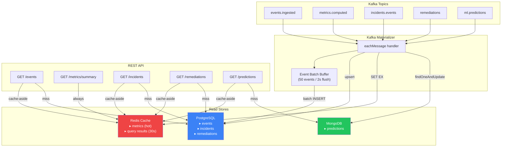
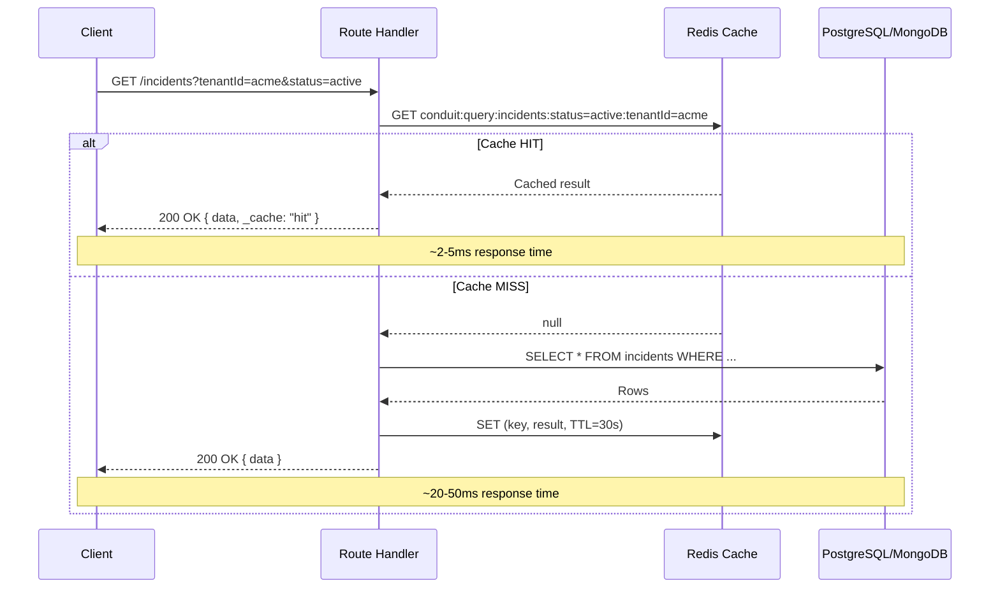

# Query Service v2 — CQRS Read Side

## What Changed (Before → After)

| Aspect | v1 (Before) | v2 (After) |
|---|---|---|
| **Storage** | In-memory arrays (`.shift()` eviction) | **PostgreSQL** + **MongoDB** + **Redis** |
| **Cache** | None | **Redis cache-aside** (30-60s TTL, auto-invalidation) |
| **Pagination** | Offset masquerading as cursor | **Real cursor pagination** (keyset via PK, mutation-safe) |
| **Routes** | Events + Metrics only | Events + Metrics + **Incidents** + **Remediations** + **Predictions** |
| **Materializer** | Push to arrays | **Batch inserts** (PG) + **Upserts** (PG/Mongo) + **Cache set** (Redis) |
| **Readiness** | None | Deterministic boot with `/ready` probe |

---

## PostgreSQL vs MongoDB — Usage Boundary

```
┌─────────────────────┬───────────────────────────────────┐
│  Store              │  What Lives Here                  │
├─────────────────────┼───────────────────────────────────┤
│  PostgreSQL (Knex)  │  Structured relational data:      │
│                     │  ▸ Events (write-once append log)  │
│                     │  ▸ Incidents (lifecycle + MTTR)    │
│                     │  ▸ Remediations (state machine)    │
│                     │  → Cursor pagination via PK/ts    │
│                     │  → JOINs for dashboard aggregates │
├─────────────────────┼───────────────────────────────────┤
│  MongoDB (Mongoose) │  Flexible schema / analytics:     │
│                     │  ▸ ML Predictions (nested JSON)    │
│                     │  ▸ Feature vectors, anomaly scores │
│                     │  → Schema-less for evolving ML     │
│                     │  → Cursor pagination via _id       │
├─────────────────────┼───────────────────────────────────┤
│  Redis              │  Hot-path cache:                  │
│                     │  ▸ Latest metrics per tenant       │
│                     │  ▸ Recent query results (30-60s)   │
│                     │  ▸ Dashboard aggregates (15s)      │
│                     │  → Sub-200ms reads guaranteed      │
└─────────────────────┴───────────────────────────────────┘
```

**Why this split?**

| Data | PostgreSQL | MongoDB | Reason |
|---|---|---|---|
| Events | ✅ | | Fixed schema, append-only, needs index on `(tenant_id, id DESC)` for fast cursor queries |
| Incidents | ✅ | | Relational (links to remediations), status lifecycle, MTTR aggregations |
| Remediations | ✅ | | Relational (links to incidents), state machine, attempt tracking |
| Metrics | | | **Neither** — ephemeral, Redis-only. No persistence needed. |
| ML Predictions | | ✅ | Deeply nested, schema-less (feature vectors, confidence arrays, labels). Would require JSONB in PG which loses type safety. |

---

## Architecture



---

## Cache-Aside Pattern



---

## Cursor Pagination

### How It Works (Keyset / PK-Based)

```
Page 1: SELECT * FROM events WHERE tenant_id = 'acme'
        ORDER BY id DESC LIMIT 26
        → Returns rows [100, 99, 98, ..., 76, 75]
        → data = rows[0..24], nextCursor = base64(75)

Page 2: SELECT * FROM events WHERE tenant_id = 'acme'
        AND id < 75
        ORDER BY id DESC LIMIT 26
        → Returns rows [74, 73, ..., 50]

Why +1?  We fetch limit+1 to detect hasMore without COUNT(*).
```

### Why Not Offset Pagination?

| Offset (`LIMIT 25 OFFSET 100`) | Cursor (`WHERE id < 75`) |
|---|---|
| ❌ Skips rows on insert/delete | ✅ Stable under mutation |
| ❌ Slower as offset grows (full scan) | ✅ Constant time (index seek) |
| ❌ Inconsistent across pages | ✅ Deterministic ordering |

---

## REST API

| Method | Path | Store | Cache | Pagination |
|---|---|---|---|---|
| `GET` | `/events` | PostgreSQL | 30s | Cursor (PK) |
| `GET` | `/metrics/summary` | Redis only | 5min | N/A |
| `GET` | `/incidents` | PostgreSQL | 30s | Cursor (PK) |
| `GET` | `/incidents/counts` | PostgreSQL | 15s | N/A |
| `GET` | `/incidents/:id` | PostgreSQL | — | N/A |
| `GET` | `/remediations` | PostgreSQL | 30s | Cursor (PK) |
| `GET` | `/remediations/by-incident/:id` | PostgreSQL | — | N/A |
| `GET` | `/predictions` | MongoDB | 60s | Cursor (_id) |
| `GET` | `/predictions/latest` | MongoDB | — | N/A |

### Response Format (Paginated)

```json
{
  "data": [ ... ],
  "pagination": {
    "cursor": "NzU=",
    "hasMore": true,
    "limit": 25
  },
  "_cache": "hit"
}
```

---

## Materializer Pipeline

| Kafka Topic | Target Store | Strategy | Cache Action |
|---|---|---|---|
| `events.ingested` | PostgreSQL | **Batch insert** (50/2s) | — |
| `metrics.computed` | Redis | **SET EX** (5min TTL) | Direct write |
| `incidents.events` | PostgreSQL | **Upsert** (ON CONFLICT merge) | Invalidate tenant keys |
| `remediations` | PostgreSQL | **Upsert** (ON CONFLICT merge) | Invalidate tenant keys |
| `ml.predictions` | MongoDB | **findOneAndUpdate** (upsert) | — |

---

## Code Structure

```
query-service/
├── package.json
└── src/
    ├── index.js                        # Deterministic boot + graceful shutdown
    ├── cache/
    │   └── redisCache.js               # Cache-aside: get/set/invalidate/buildKey
    ├── db/
    │   ├── postgres.js                 # Knex connection + auto-migration
    │   └── mongo.js                    # Mongoose connection + Prediction model
    ├── consumers/
    │   └── materializer.js             # Kafka → DB/Cache (batch + upsert)
    └── routes/
        ├── events.js                   # Cursor pagination + cache-aside
        ├── metrics.js                  # Redis-only (hot path)
        ├── incidents.js                # Cursor + counts dashboard
        ├── remediations.js             # Cursor + by-incident lookup
        └── predictions.js             # MongoDB cursor + latest
```

---

## Performance Budget

| Operation | Target | Mechanism |
|---|---|---|
| Cache hit | **< 5ms** | Redis GET + JSON parse |
| Cache miss (PostgreSQL) | **< 50ms** | Indexed query + keyset cursor |
| Cache miss (MongoDB) | **< 80ms** | Indexed query + _id cursor |
| Metrics read | **< 3ms** | Always Redis (no DB fallback) |
| Dashboard counts | **< 20ms** | Cached 15s, COUNT + GROUP BY |

All reads target **< 200ms** even under worst-case conditions.

---

## Tuning Knobs

| Env Variable | Default | Description |
|---|---|---|
| `QUERY_PORT` | `4004` | HTTP server port |
| `CACHE_TTL_SECONDS` | `60` | Default Redis cache TTL |
| `QUERY_BATCH_SIZE` | `50` | Event batch insert size |
| `QUERY_FLUSH_INTERVAL_MS` | `2000` | Event batch flush interval |
| `PG_HOST` | `localhost` | PostgreSQL host |
| `PG_DATABASE` | `conduit_query` | PostgreSQL database name |
| `PG_POOL_MAX` | `10` | PostgreSQL connection pool max |
| `MONGO_URI` | `mongodb://localhost:27017/conduit_query` | MongoDB connection URI |
| `MONGO_POOL_MAX` | `5` | MongoDB connection pool max |

---

## Files Modified

| File | Change |
|---|---|
| [redisCache.js](file:///d:/congnigant/backend-v1/services/query-service/src/cache/redisCache.js) | **NEW** — Cache-aside layer with deterministic keys |
| [postgres.js](file:///d:/congnigant/backend-v1/services/query-service/src/db/postgres.js) | **NEW** — Knex connection + auto-migration (3 tables) |
| [mongo.js](file:///d:/congnigant/backend-v1/services/query-service/src/db/mongo.js) | **NEW** — Mongoose connection + Prediction model |
| [materializer.js](file:///d:/congnigant/backend-v1/services/query-service/src/consumers/materializer.js) | **REBUILT** — Batch PG inserts + Mongo upserts + cache writes |
| [events.js](file:///d:/congnigant/backend-v1/services/query-service/src/routes/events.js) | **REBUILT** — Real cursor pagination + cache-aside |
| [metrics.js](file:///d:/congnigant/backend-v1/services/query-service/src/routes/metrics.js) | **REBUILT** — Redis-only reads |
| [incidents.js](file:///d:/congnigant/backend-v1/services/query-service/src/routes/incidents.js) | **NEW** — Cursor + counts dashboard |
| [remediations.js](file:///d:/congnigant/backend-v1/services/query-service/src/routes/remediations.js) | **NEW** — Cursor + by-incident lookup |
| [predictions.js](file:///d:/congnigant/backend-v1/services/query-service/src/routes/predictions.js) | **NEW** — MongoDB cursor + latest endpoint |
| [index.js](file:///d:/congnigant/backend-v1/services/query-service/src/index.js) | **REBUILT** — Deterministic boot + graceful shutdown |
| [.env.example](file:///d:/congnigant/backend-v1/.env.example) | **UPDATED** — Added PG, Mongo, cache config |
