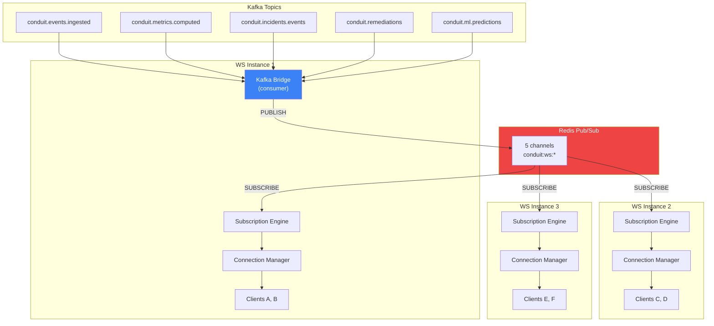
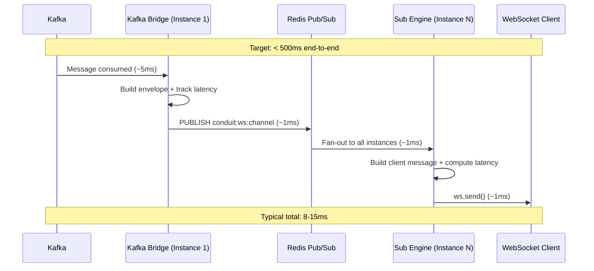

# WebSocket Service v2 — Scalable Real-Time Push

## What Changed (Before → After)

| Aspect | v1 (Before) | v2 (After) |
|---|---|---|
| **Horizontal Scaling** | Instance-local broadcast only | **Redis Pub/Sub** fan-out to all instances |
| **Backpressure** | None — slow clients stall the loop | Drops clients exceeding `WS_MAX_BUFFERED_BYTES` (64KB) |
| **Event Format** | Ad-hoc `{ type, channel, data }` | Structured envelope with `eventType`, `latency`, `meta` |
| **Latency Tracking** | None | Bridge latency + client-facing latency in every message |
| **Batch Subscribe** | One channel at a time | `{ type: "subscribe", channels: [...] }` |
| **Health Endpoint** | Basic connection count | Connection stats + bridge latency + per-channel breakdown |

---

## Architecture



> [!IMPORTANT]
> Only **one instance** runs the Kafka consumer (partition assignment). Redis Pub/Sub fans every message to **all instances**, ensuring every connected client receives updates regardless of which pod they're on.

---

## Data Flow (Latency Path)



---

## Event Envelope (Client-Facing)

Every message pushed to WebSocket clients follows this format:

```json
{
  "type": "event",
  "channel": "incidents:alerts",
  "eventType": "incident.detected",
  "data": {
    "incidentId": "a1b2c3d4-...",
    "tenantId": "acme-corp",
    "severity": "high",
    "type": "error_rate_breach",
    "description": "Error rate 12.3% exceeds threshold 5%",
    "detectedAt": "2026-05-03T00:10:00.000Z"
  },
  "timestamp": "2026-05-03T00:10:00.012Z",
  "latency": 12
}
```

| Field | Description |
|---|---|
| `type` | Always `"event"` for data messages |
| `channel` | The WebSocket channel (e.g., `incidents:alerts`) |
| `eventType` | Derived from Kafka payload or topic (e.g., `incident.detected`) |
| `data` | Raw payload from the upstream service |
| `timestamp` | Server-side timestamp when broadcast was initiated |
| `latency` | Milliseconds from Redis bridge to WebSocket send (SLA tracking) |

---

## Channel Registry

| WebSocket Channel | Kafka Source | Content |
|---|---|---|
| `events:live` | `conduit.events.ingested` | Raw ingested events |
| `metrics:dashboard` | `conduit.metrics.computed` | Aggregated metric snapshots |
| `incidents:alerts` | `conduit.incidents.events` | Incident lifecycle events |
| `remediations:actions` | `conduit.remediations` | Autonomous remediation actions |
| `ml:predictions` | `conduit.ml.predictions` | ML anomaly predictions |

---

## Client Protocol

### Connection

```
ws://host:4006?token=<JWT>
```

### Welcome Message (on connect)

```json
{
  "type": "connected",
  "clientId": "a1b2c3d4-...",
  "availableChannels": ["events:live", "metrics:dashboard", "incidents:alerts", "remediations:actions", "ml:predictions"],
  "serverTime": "2026-05-03T00:10:00.000Z"
}
```

### Subscribe (single or batch)

```json
{ "type": "subscribe", "channel": "incidents:alerts" }
```

```json
{ "type": "subscribe", "channels": ["incidents:alerts", "metrics:dashboard"] }
```

### Unsubscribe

```json
{ "type": "unsubscribe", "channel": "incidents:alerts" }
```

### Application Ping

```json
{ "type": "ping" }
→ { "type": "pong", "serverTime": "..." }
```

---

## Code Structure

```
websocket-service/
├── package.json
└── src/
    ├── index.js                          # Boot lifecycle + health + readiness
    ├── infra/
    │   └── redisPubSub.js                # Redis Pub/Sub adapter (horizontal scaling)
    ├── bridge/
    │   └── kafkaBridge.js                # Kafka → Redis (envelope builder + latency)
    ├── subscriptions/
    │   └── subscriptionEngine.js         # Redis → local broadcast
    └── connections/
        └── connectionManager.js          # WS server, auth, heartbeat, backpressure
```

---

## Horizontal Scaling Strategy

```
                    ┌─────────────────────┐
                    │  Load Balancer       │
                    │  (sticky sessions    │
                    │   via IP hash)       │
                    └────────┬────────────┘
                             │
              ┌──────────────┼──────────────┐
              │              │              │
        ┌─────┴─────┐ ┌─────┴─────┐ ┌─────┴─────┐
        │  WS Pod 1  │ │  WS Pod 2  │ │  WS Pod 3  │
        │  Kafka ✓   │ │  Kafka ✗   │ │  Kafka ✗   │
        │  Redis Sub │ │  Redis Sub │ │  Redis Sub │
        └─────┬─────┘ └─────┬─────┘ └─────┬─────┘
              │              │              │
              └──────────────┴──────────────┘
                             │
                    ┌────────┴────────┐
                    │   Redis Server   │
                    └─────────────────┘
```

**Key points:**
- Only 1 pod consumes Kafka (partition assignment via consumer group)
- ALL pods subscribe to Redis Pub/Sub channels
- Clients use sticky sessions (IP hash) at the load balancer
- Any pod can serve any client — Redis ensures message delivery

---

## Backpressure Protection

```
  Client send buffer > 64KB?
      │
      ├── YES → Skip this client (log warning)
      │          Client will "catch up" on next message
      │
      └── NO  → ws.send(serialized)
```

This prevents slow clients (e.g., mobile on 3G) from blocking the broadcast loop and stalling all other clients on the same instance.

---

## Tuning Knobs

| Env Variable | Default | Description |
|---|---|---|
| `WS_PORT` | `4006` | HTTP + WebSocket server port |
| `WS_MAX_BUFFERED_BYTES` | `65536` | Backpressure threshold (64KB) |
| `JWT_SECRET` | `dev-secret` | JWT verification secret |

---

## Files Modified

| File | Change |
|---|---|
| [redisPubSub.js](file:///d:/congnigant/backend-v1/services/websocket-service/src/infra/redisPubSub.js) | **NEW** — Redis pub/sub adapter for horizontal scaling |
| [kafkaBridge.js](file:///d:/congnigant/backend-v1/services/websocket-service/src/bridge/kafkaBridge.js) | **REBUILT** — Kafka → Redis with structured envelope + latency tracking |
| [subscriptionEngine.js](file:///d:/congnigant/backend-v1/services/websocket-service/src/subscriptions/subscriptionEngine.js) | **REBUILT** — Redis subscriber with client-facing latency |
| [connectionManager.js](file:///d:/congnigant/backend-v1/services/websocket-service/src/connections/connectionManager.js) | **REBUILT** — Backpressure, batch subscribe, per-channel stats |
| [index.js](file:///d:/congnigant/backend-v1/services/websocket-service/src/index.js) | **REBUILT** — Deterministic boot, readiness probe, detailed health |
| [.env.example](file:///d:/congnigant/backend-v1/.env.example) | **UPDATED** — Added `WS_MAX_BUFFERED_BYTES` |
